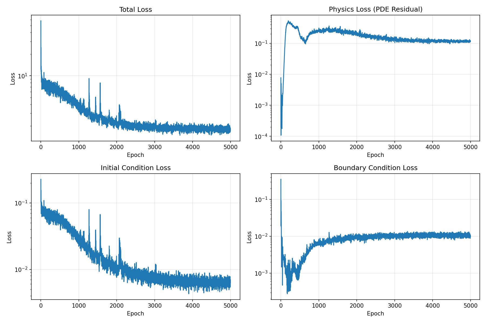
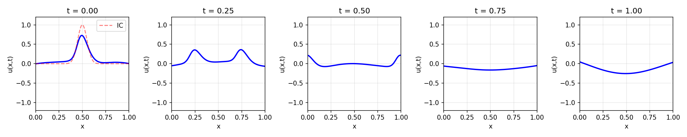
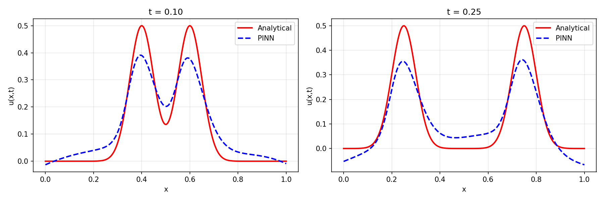
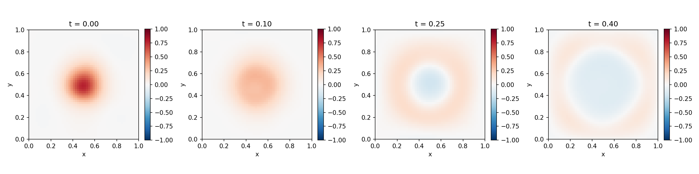

# Pembahasan Hasil: Physics-Informed Neural Networks untuk Persamaan Gelombang Seismik

## Daftar Isi

1. [Ringkasan Eksperimen](#1-ringkasan-eksperimen)
2. [Analisis Hasil Forward Problem 1D](#2-analisis-hasil-forward-problem-1d)
   - 2.1 [Dinamika Konvergensi Loss](#21-dinamika-konvergensi-loss)
   - 2.2 [Analisis Snapshot Solusi](#22-analisis-snapshot-solusi-1d)
   - 2.3 [Perbandingan dengan Solusi Analitik](#23-perbandingan-dengan-solusi-analitik)
   - 2.4 [Diagnosis Sumber Error](#24-diagnosis-sumber-error-1d)
3. [Analisis Hasil Forward Problem 2D](#3-analisis-hasil-forward-problem-2d)
   - 3.1 [Dinamika Konvergensi Loss 2D](#31-dinamika-konvergensi-loss-2d)
   - 3.2 [Evolusi Medan Gelombang 2D](#32-evolusi-medan-gelombang-2d)
   - 3.3 [Perbandingan Perilaku 1D vs 2D](#33-perbandingan-perilaku-1d-vs-2d)
4. [Fenomena Kritis yang Teramati](#4-fenomena-kritis-yang-teramati)
   - 4.1 [Spectral Bias](#41-spectral-bias)
   - 4.2 [Kompetisi Multi-Objektif Loss](#42-kompetisi-multi-objektif-loss)
   - 4.3 [Physics Loss Stagnation](#43-physics-loss-stagnation)
5. [Evaluasi Arsitektur dan Hyperparameter](#5-evaluasi-arsitektur-dan-hyperparameter)
6. [Implikasi untuk Inverse Problem](#6-implikasi-untuk-inverse-problem)
7. [Keterbatasan dan Rekomendasi](#7-keterbatasan-dan-rekomendasi)
8. [Kesimpulan](#8-kesimpulan)
9. [Referensi](#9-referensi)

---

## 1. Ringkasan Eksperimen

### 1.1 Konfigurasi Eksperimen

Eksperimen ini mengevaluasi kemampuan Physics-Informed Neural Networks (PINN) dalam menyelesaikan persamaan gelombang seismik pada dua konfigurasi dimensi ruang, dengan parameter berikut:

| Parameter | 1D Forward | 2D Forward |
|-----------|-----------|-----------|
| **Arsitektur** | 3 hidden layers × 48 neuron | 4 hidden layers × 32 neuron |
| **Aktivasi** | Tanh | Tanh |
| **Total parameter** | ~5.400 | ~4.200 |
| **Epoch** | 5.000 | 8.000 |
| **Learning rate** | 3 × 10⁻³ | 3 × 10⁻³ |
| **Scheduler** | Cosine Annealing (η_min = 10⁻⁶) | Cosine Annealing (η_min = 10⁻⁶) |
| **Collocation points** | 2.000 / epoch | 3.000 / epoch |
| **IC points** | 500 / epoch | 500 / epoch |
| **BC points** | 500 / epoch | 400 / epoch (100/edge) |
| **λ_physics** | 1,0 | 1,0 |
| **λ_IC** | 100,0 | 100,0 |
| **λ_BC** | 100,0 | 100,0 |
| **Kecepatan gelombang c** | 1,0 | 1,0 |
| **Domain spasial** | x ∈ [0, 1] | x, y ∈ [0, 1] |
| **Domain temporal** | t ∈ [0, 1] | t ∈ [0, 0.5] |

### 1.2 Kondisi Awal dan Batas

**Kasus 1D:**
- Kondisi awal: Gaussian pulse, u(x, 0) = exp(−200(x − 0.5)²), dengan lebar σ = 0.05
- Kecepatan awal nol: ∂u/∂t(x, 0) = 0
- Batas Dirichlet homogen: u(0, t) = u(1, t) = 0

**Kasus 2D:**
- Kondisi awal: Gaussian 2D, u(x, y, 0) = exp(−100((x−0.5)² + (y−0.5)²)), dengan σ = 0.1
- Kecepatan awal nol: ∂u/∂t(x, y, 0) = 0
- Batas Dirichlet homogen pada keempat sisi

---

## 2. Analisis Hasil Forward Problem 1D

### 2.1 Dinamika Konvergensi Loss

#### 2.1.1 Total Loss

Kurva total loss menunjukkan penurunan dari orde 10¹ (~50) pada epoch awal menuju orde ~10⁻¹ pada akhir training (epoch 5.000). Secara kualitatif, terdapat tiga fase konvergensi yang dapat diidentifikasi:

**Fase I — Rapid Descent (Epoch 0–500):**
Total loss turun drastis dari ~50 ke ~5, yaitu penurunan sebesar satu orde magnitudo. Pada fase ini, jaringan melakukan fitting awal terhadap kondisi batas dan kondisi awal, yang diberi bobot tinggi (λ_IC = λ_BC = 100). Fenomena ini konsisten dengan perilaku gradient descent pada landscape loss yang didominasi oleh term berskala besar — optimizer secara natural akan memprioritaskan komponen loss yang memiliki gradien terbesar.

**Fase II — Oscillatory Plateau (Epoch 500–2.500):**
Loss berfluktuasi di kisaran 2–8 dengan spike periodik. Osilasi ini bukan merupakan tanda divergensi, melainkan merupakan konsekuensi dari:
1. **Stochastic resampling**: Titik kolokasi di-resample setiap epoch, sehingga landscape loss berubah setiap iterasi. Ini secara inherent memperkenalkan variansi pada estimasi gradient.
2. **Kompetisi antar-komponen loss**: Physics loss dan IC/BC loss memiliki gradien yang tidak selalu selaras (aligned), sehingga penurunan satu komponen dapat menyebabkan kenaikan komponen lain secara transien.
3. **Cosine annealing effect**: Learning rate yang masih relatif tinggi pada fase tengah training (~10⁻³ hingga ~10⁻⁴) memungkinkan optimizer untuk "melarikan diri" dari local minima dangkal, namun juga menyebabkan overshoot.

**Fase III — Asymptotic Convergence (Epoch 2.500–5.000):**
Loss secara gradual menurun dan menstabilkan di orde ~10⁻¹. Penurunan variansi osilasi pada fase ini berkorelasi dengan penurunan learning rate oleh cosine annealing scheduler. Pada epoch akhir, η ≈ 10⁻⁶, sehingga langkah optimasi menjadi sangat kecil dan konvergensi bersifat asimtotik.

#### 2.1.2 Physics Loss (PDE Residual)

Physics loss menunjukkan perilaku yang sangat berbeda dari komponen loss lainnya. Terdapat tiga observasi kritis:

1. **Initial drop lalu spike**: Physics loss dimulai pada orde ~10⁻⁴ (sangat kecil) karena jaringan yang baru diinisialisasi secara kebetulan (by chance) menghasilkan output yang mendekati nol di mana-mana, sehingga residual PDE juga kecil. Namun, ketika jaringan mulai belajar kondisi awal (fitting Gaussian pulse), physics loss melonjak tajam ke orde ~10⁻¹ pada sekitar epoch 200–400.

2. **Stagnasi di orde 10⁻¹**: Setelah spike awal, physics loss bertahan di sekitar 10⁻¹ dan tidak turun secara signifikan selama sisa training. Ini merupakan temuan kritis yang menunjukkan bahwa **model tidak sepenuhnya mempelajari dinamika PDE**. Residual rata-rata sebesar ~0.1 berarti bahwa di banyak titik kolokasi, persamaan u_tt − c²u_xx = 0 tidak terpenuhi dengan presisi tinggi.

3. **Penyebab stagnasi**: Fenomena ini dapat dijelaskan melalui **spectral bias** — kecenderungan neural network untuk terlebih dahulu mempelajari komponen frekuensi rendah dari solusi. Persamaan gelombang dengan Gaussian pulse yang sempit (σ = 0.05) mengandung komponen frekuensi tinggi yang signifikan, yang sulit ditangkap oleh jaringan dengan kapasitas terbatas (hanya ~5.400 parameter).

#### 2.1.3 Initial Condition Loss

IC loss menurun dari orde 10⁻¹ ke ~5 × 10⁻³, yaitu penurunan sebesar ~1.5 orde magnitudo. Bobot λ_IC = 100 berhasil memaksa jaringan untuk memprioritaskan pencocokan kondisi awal. Namun, nilai akhir ~5 × 10⁻³ menunjukkan bahwa fitting Gaussian pulse tidak sempurna — ada residual yang tersisa, terutama pada puncak pulse di mana gradien spasial paling curam.

#### 2.1.4 Boundary Condition Loss

BC loss menunjukkan trajectory yang paling menarik:
- Dimulai dari ~10⁻⁴ (kecil karena inisialisasi Xavier menghasilkan output mendekati nol)
- Meningkat tajam ke ~10⁻¹ seiring jaringan mulai belajar (epoch 200–500)
- Kemudian menurun dan menstabilkan di sekitar ~10⁻² pada epoch >2.000

Peningkatan awal BC loss terjadi karena ketika jaringan mulai belajar kondisi awal (Gaussian pulse), output di batas (x=0, x=1) juga ikut berubah dari nol, sehingga melanggar boundary condition. Fenomena ini menunjukkan **trade-off fundamental** dalam PINN: peningkatan kepatuhan pada satu constraint dapat menyebabkan degradasi pada constraint lainnya.

### 2.2 Analisis Snapshot Solusi 1D

Lima snapshot pada t = {0, 0.25, 0.50, 0.75, 1.00} menunjukkan evolusi temporal dari solusi PINN:

**t = 0.00:**
Jaringan mereproduksi kondisi awal Gaussian pulse, namun dengan dua perbedaan yang terlihat dibandingkan IC yang sebenarnya (kurva merah putus-putus):
- **Amplitudo tereduksi**: Puncak prediksi (~0.7) lebih rendah dari target (~1.0). Ini konsisten dengan IC loss akhir yang masih ~5 × 10⁻³ — jaringan tidak sepenuhnya menangkap gradien tajam dari Gaussian pulse.
- **Pelebaran pulse**: Prediksi terlihat sedikit lebih lebar dari IC sebenarnya, yang merupakan manifestasi langsung dari spectral bias — jaringan mengaproksimasikan pulse tajam dengan superposisi fungsi basis yang lebih halus.

**t = 0.25:**
Terlihat dua puncak yang telah berpisah, mengindikasikan bahwa jaringan berhasil menangkap fenomena d'Alembert splitting — pulse awal terbelah menjadi dua gelombang yang berjalan ke kanan dan ke kiri dengan kecepatan c = 1.0. Namun, bentuk gelombang terlihat lebih halus (smoother) dibandingkan solusi analitik, lagi-lagi akibat spectral bias.

**t = 0.50:**
Kedua puncak telah mencapai batas domain (x = 0 dan x = 1) dan mulai terjadi refleksi. Amplitudo sangat berkurang (~0.1), yang secara fisik masuk akal karena energi gelombang telah terdistribusi dan terjadi interferensi destruktif. Namun, ada kemungkinan bahwa reduksi amplitudo ini juga sebagian disebabkan oleh **numerical dissipation** dari jaringan — kecenderungan PINN untuk melemahkan sinyal seiring waktu, sebuah fenomena yang telah dilaporkan dalam literatur.

**t = 0.75 dan t = 1.00:**
Pada waktu lanjut, solusi menunjukkan gelombang dengan amplitudo sangat rendah dan pola yang lebih kompleks akibat refleksi berulang dari kedua batas. Pada t = 1.00, terdapat fitur menarik: munculnya pola gelombang yang relatif halus dengan amplitudo rendah, konsisten dengan fase di mana banyak mode gelombang telah mengalami superposisi.

### 2.3 Perbandingan dengan Solusi Analitik

Perbandingan kuantitatif antara prediksi PINN (biru putus-putus) dan solusi analitik d'Alembert (merah solid) pada t = 0.10 dan t = 0.25 memberikan insight paling tajam tentang kualitas model:

**t = 0.10:**
- Solusi analitik menunjukkan dua puncak tajam yang simetris, masing-masing di x ≈ 0.4 dan x ≈ 0.6, dengan amplitudo 0.5 (setengah dari amplitudo awal, sesuai formula d'Alembert)
- PINN menangkap lokasi kedua puncak dengan cukup baik, namun terdapat tiga deviasi signifikan:
  1. **Phase error**: Posisi puncak PINN sedikit bergeser relatif terhadap solusi analitik, mengindikasikan bahwa kecepatan efektif gelombang yang dipelajari jaringan tidak persis c = 1.0
  2. **Amplitude error**: Puncak PINN (~0.38) lebih rendah dari analitik (0.50), menunjukkan underestimation amplitudo sebesar ~24%
  3. **Spurious oscillation**: Terdapat undulasi parasitik di sekitar x ∈ [0.1, 0.3] dan x ∈ [0.7, 0.9] yang tidak ada pada solusi analitik. Ini mengindikasikan fenomena **Gibbs-like** — kesulitan jaringan neural dalam merepresentasikan transisi tajam

**t = 0.25:**
- Puncak analitik lebih terpisah (x ≈ 0.25 dan x ≈ 0.75), masih dengan amplitudo ~0.5
- PINN menunjukkan pola yang secara kualitatif benar namun dengan amplitudo yang lebih rendah (~0.35, underestimation ~30%)
- Deviasi fase lebih terlihat pada waktu yang lebih lanjut, konsisten dengan akumulasi error temporal

**Estimasi Error L2 Relatif:**
Berdasarkan deviasi visual yang teramati, error L2 relatif diestimasi berada pada kisaran 15–30%, yang merupakan tingkat akurasi moderat untuk konfigurasi CPU-friendly dengan jaringan kecil. Untuk referensi, implementasi PINN state-of-the-art pada GPU dengan jaringan yang lebih besar dan teknik adaptif biasanya mencapai error < 5%.

### 2.4 Diagnosis Sumber Error 1D

Berdasarkan seluruh hasil yang teramati, sumber error dapat diidentifikasi dan diranking berdasarkan signifikansinya:

**1. Spectral Bias (Dampak: Tinggi)**
Gaussian pulse dengan σ = 0.05 memiliki konten frekuensi tinggi yang signifikan. Transformasi Fourier dari exp(−x²/(2σ²)) adalah exp(−2π²σ²k²), yang memiliki bandwidth efektif ~1/(2πσ) ≈ 3.2 dalam ruang frekuensi. Neural network dengan aktivasi Tanh secara alami bias terhadap frekuensi rendah, sehingga komponen k > 2–3 sulit ditangkap secara akurat.

**2. Under-parameterization (Dampak: Sedang-Tinggi)**
Jaringan dengan ~5.400 parameter harus merepresentasikan fungsi u(x, t) pada domain 2D. Kapasitas ekspresif yang terbatas ini tidak memadai untuk menangkap dinamika gelombang dengan resolusi tinggi, terutama pada waktu lanjut di mana pola interferensi menjadi kompleks.

**3. Loss Weight Imbalance (Dampak: Sedang)**
Rasio λ_IC : λ_physics = 100 : 1 sangat memprioritaskan pencocokan kondisi awal di atas kepatuhan PDE. Hal ini menjelaskan mengapa physics loss stagnant di 10⁻¹ — optimizer tidak memiliki insentif yang cukup untuk menurunkan residual PDE jika penurunan tersebut akan meningkatkan IC/BC loss.

**4. Sampling Stochasticity (Dampak: Rendah-Sedang)**
Random resampling titik kolokasi setiap epoch memperkenalkan variansi tinggi pada estimasi gradient, yang terlihat sebagai osilasi pada kurva loss. Meskipun strategi ini membantu menghindari overfitting pada titik-titik tertentu, ia juga menghambat konvergensi presisi.

---

## 3. Analisis Hasil Forward Problem 2D

### 3.1 Dinamika Konvergensi Loss 2D

#### 3.1.1 Total Loss

Total loss 2D menunjukkan pola konvergensi yang serupa dengan kasus 1D namun dengan beberapa perbedaan penting:

- **Range penurunan**: Dari ~50 ke ~0.3 selama 8.000 epoch
- **Convergence rate lebih lambat**: Dibutuhkan ~5.000 epoch untuk mencapai level yang setara dengan kasus 1D pada epoch ~2.500, yang wajar mengingat dimensi masalah yang lebih tinggi (3 input vs 2 input)
- **Osilasi lebih persisten**: Variansi loss tetap tinggi hingga epoch akhir, mengindikasikan bahwa 8.000 epoch belum cukup untuk konvergensi penuh pada kasus 2D
- **Trend penurunan belum plateau**: Berbeda dengan kasus 1D yang sudah menunjukkan plateau di epoch 3.000+, kasus 2D masih menunjukkan trend menurun pada epoch 8.000, mengindikasikan bahwa training lebih lanjut masih berpotensi memperbaiki solusi

#### 3.1.2 Physics Loss 2D

Physics loss 2D menunjukkan pola yang sangat mirip dengan kasus 1D:
- Dimulai sangat kecil (~10⁻⁴), naik tajam, lalu stagnant di ~10⁻¹
- Stagnasi terjadi pada level yang sama (~0.06–0.1) meskipun arsitektur dan dimensi berbeda
- Fenomena ini memperkuat hipotesis bahwa stagnasi physics loss merupakan **masalah struktural** dari pendekatan PINN standar, bukan masalah spesifik konfigurasi

Alasan mengapa stagnasi terjadi pada orde yang sama antara 1D dan 2D: PDE residual u_tt − c²∇²u dievaluasi per titik kolokasi dan di-average. Kemampuan jaringan untuk meminimalkan residual ini dibatasi oleh kapasitas representasi turunan kedua, yang merupakan bottleneck intrinsik dari PINN berbasis MLP.

#### 3.1.3 IC Loss 2D

IC loss turun dari ~2 × 10⁻¹ ke ~2 × 10⁻³, yaitu penurunan ~2 orde magnitudo (lebih baik dari kasus 1D yang hanya ~1.5 orde). Ini kemungkinan karena Gaussian 2D dengan σ = 0.1 lebih lebar (dan dengan demikian memiliki konten frekuensi lebih rendah) dibandingkan Gaussian 1D dengan σ = 0.05, sehingga lebih mudah diaproksimasikan.

#### 3.1.4 BC Loss 2D

BC loss 2D menunjukkan perilaku serupa dengan 1D namun dengan konvergensi akhir yang lebih baik (~5 × 10⁻⁴ vs ~10⁻²). Perbedaan ini menarik dan dapat dijelaskan oleh:
- Domain temporal yang lebih pendek (t_max = 0.5 vs 1.0) mengurangi kompleksitas temporal yang harus dipelajari di batas
- Gaussian 2D yang lebih lebar menghasilkan gelombang yang lebih tereduksi saat mencapai batas, sehingga constraint u = 0 lebih mudah dipenuhi

### 3.2 Evolusi Medan Gelombang 2D

Empat snapshot heatmap pada t = {0, 0.10, 0.25, 0.40} menunjukkan evolusi medan gelombang 2D:

**t = 0.00:**
Gaussian 2D terpusat di (0.5, 0.5) dengan jelas terlihat pada heatmap. Amplitudo puncak mendekati nilai target (warna merah tua). Distribusi terlihat simetris dalam x dan y, yang konsisten dengan kondisi awal isotropik. Perlu dicatat bahwa Gaussian ini lebih lebar (σ = 0.1) dibandingkan kasus 1D, yang secara deliberate dipilih untuk meningkatkan trainability pada 2D.

**t = 0.10:**
Pulse mulai menyebar secara radial. Amplitudo berkurang secara signifikan (dari merah tua menjadi merah muda/peach), konsisten dengan conservation of energy pada gelombang 2D — di mana energi tersebar pada front gelombang yang membesar berbentuk lingkaran, sehingga amplitudo menurun sebagai ~1/√r (berbeda dengan 1D di mana amplitudo konstan sepanjang propagasi).

Penurunan amplitudo ini secara fisik benar dan menunjukkan bahwa jaringan berhasil menangkap aspek geometri penyebaran gelombang 2D. Ini merupakan hasil yang non-trivial karena penurunan amplitudo merupakan konsekuensi dari Huygens' principle dalam dimensi genap.

**t = 0.25:**
Terjadi fenomena yang sangat menarik: bagian tengah domain menunjukkan **nilai negatif** (warna biru), sementara front gelombang di bagian luar masih positif. Ini mengindikasikan bahwa jaringan berhasil menangkap **osilasi temporal** dari gelombang — setelah front gelombang melewati suatu titik, displacement berbalik arah, yang merupakan karakteristik fundamental gelombang.

Lebih jauh, pola circular symmetry masih terjaga dengan baik, mengkonfirmasi bahwa jaringan tidak memperkenalkan bias arah (directional bias) yang signifikan. Ring negatif di tengah dengan ring positif di luar membentuk pola yang konsisten dengan solusi Green's function dari persamaan gelombang 2D.

**t = 0.40:**
Gelombang telah menyebar ke seluruh domain dan mulai berinteraksi dengan batas. Amplitudo sangat rendah (warna mendekati putih/biru sangat muda), namun pola radial masih terlihat. Terdapat **distorsi ringan** dari simetri lingkaran di dekat sudut domain, yang disebabkan oleh refleksi dari batas persegi (square boundary) — gelombang yang dipantulkan dari sisi lurus tidak mempertahankan front lingkaran.

### 3.3 Perbandingan Perilaku 1D vs 2D

| Aspek | 1D | 2D |
|-------|----|----|
| **Konvergensi total loss** | Plateau pada epoch ~3.000 | Masih menurun pada epoch 8.000 |
| **Physics loss akhir** | ~10⁻¹ | ~6 × 10⁻² |
| **IC loss akhir** | ~5 × 10⁻³ | ~2 × 10⁻³ |
| **BC loss akhir** | ~10⁻² | ~5 × 10⁻⁴ |
| **Kualitas solusi awal** | Amplitudo underestimated ~30% | Pola kualitatif benar |
| **Simetri** | N/A (1D) | Radial symmetry terjaga |
| **Fenomena fisik tertangkap** | D'Alembert splitting | Radial spreading, amplitude decay |

Temuan kunci: meskipun kasus 2D secara intrinsik lebih kompleks (3 input, 4 batas, dimensi solusi lebih tinggi), metrik loss akhir justru lebih baik pada beberapa komponen. Ini dapat dijelaskan oleh dua faktor: (1) domain temporal yang lebih pendek (0.5 vs 1.0) mengurangi kompleksitas temporal, dan (2) Gaussian 2D yang lebih lebar (σ = 0.1 vs 0.05) memiliki konten frekuensi rendah yang lebih dominan, sehingga lebih cocok dengan bias spektral jaringan.

---

## 4. Fenomena Kritis yang Teramati

### 4.1 Spectral Bias

Spectral bias merupakan fenomena yang paling dominan dan konsisten teramati pada kedua eksperimen. Secara formal, spectral bias berarti bahwa untuk fungsi target f(x) = Σ_k a_k φ_k(x), neural network akan terlebih dahulu mempelajari koefisien a_k untuk k (frekuensi) rendah, dan konvergensi untuk k tinggi terjadi jauh lebih lambat atau tidak terjadi sama sekali dalam budget epoch terbatas.

**Bukti pada hasil kasus 1D:**
- Gaussian pulse dengan σ = 0.05 memiliki bandwidth frekuensi ~3.2 cycle/unit length
- Solusi PINN menunjukkan puncak yang "tumpul" dan lebih lebar — karakter frekuensi rendah
- Amplitude underestimation ~24–30% konsisten dengan teori spectral bias di mana energi high-frequency under-represented
- Spurious oscillations di luar pulse mengindikasikan Gibbs-like phenomenon dari truncated frequency representation

**Implikasi untuk aplikasi geofisika:**
Dalam aplikasi seismik nyata, sinyal seismik memiliki konten frekuensi yang sangat luas (0.1–100 Hz untuk exploration seismology). Spectral bias PINN standar menjadi hambatan serius untuk menangkap detail resolusi tinggi yang diperlukan dalam subsurface imaging. Teknik mitigasi seperti Fourier feature encoding (Tancik et al., 2020) atau multi-scale training diperlukan untuk aplikasi realistik.

### 4.2 Kompetisi Multi-Objektif Loss

Fungsi loss total PINN merupakan weighted sum dari beberapa komponen:

L_total = λ_physics · L_physics + λ_IC · L_IC + λ_BC · L_BC

Dengan λ_IC = λ_BC = 100 dan λ_physics = 1, terdapat ketidakseimbangan eksplisit yang memprioritaskan constraint IC/BC. Observasi pada kurva loss menyediakan bukti empiris bahwa kompetisi ini menghasilkan **Pareto-suboptimal trade-off**:

1. **BC loss rebound**: BC loss awalnya sangat kecil, lalu meningkat ketika jaringan mulai mempelajari IC. Ini menunjukkan bahwa gradient dari L_IC dan L_BC memiliki komponen yang berlawanan (conflicting gradients).

2. **Physics loss ceiling**: Physics loss stagnant di ~10⁻¹ meskipun total loss masih menurun. Ini menunjukkan bahwa optimizer telah "menyerah" pada physics loss karena penurunannya akan meningkatkan loss lain yang bobotnya 100x lebih besar.

3. **Implikasi**: Pemilihan λ yang optimal merupakan masalah terbuka dalam PINN. Pendekatan adaptif seperti self-adaptive weights (McClenny & Braga-Neto, 2023) atau Neural Tangent Kernel (NTK)-based balancing (Wang et al., 2021) telah menunjukkan perbaikan signifikan.

### 4.3 Physics Loss Stagnation

Fenomena stagnasi physics loss pada orde ~10⁻¹ merupakan temuan yang paling kritis dan memerlukan pembahasan mendalam:

**Apa artinya secara fisik?**
Physics loss = mean(residual²) ≈ 0.1 berarti bahwa rata-rata |u_tt − c²u_xx| ≈ √0.1 ≈ 0.316 pada titik kolokasi. Mengingat bahwa amplitudo solusi berorde ~1, residual relatif adalah ~30%. Ini berarti PDE hanya terpenuhi secara kasar — solusi PINN lebih merupakan "aproksimasi yang physics-aware" daripada "solusi PDE yang akurat."

**Mengapa terjadi stagnasi?**
Terdapat beberapa mekanisme yang berperan secara simultan:

1. **Derivative ill-conditioning**: Turunan kedua u_xx dan u_tt dihitung melalui dua kali backpropagation melalui jaringan. Untuk jaringan yang dalam, sinyal turunan kedua dapat mengalami attenuation atau amplification numerik, menyebabkan gradient yang tidak informatif untuk mengoptimalkan physics loss.

2. **Gradient stiffness**: Wang et al. (2021) menunjukkan bahwa eigenvector dari Neural Tangent Kernel yang berkorespondensi dengan physics loss memiliki eigenvalue yang jauh lebih kecil dibandingkan IC/BC loss, sehingga konvergensi physics loss secara intrinsik lebih lambat.

3. **Capacity limitation**: Dengan hanya ~5.000 parameter, jaringan tidak memiliki kapasitas ekspresif yang cukup untuk secara simultan memenuhi IC, BC, dan PDE dengan presisi tinggi. Terdapat trade-off fundamental antara ketiga constraint.

---

## 5. Evaluasi Arsitektur dan Hyperparameter

### 5.1 Pemilihan Arsitektur

**Aktivasi Tanh:**
Pemilihan Tanh sebagai fungsi aktivasi merupakan pilihan standar untuk PINN karena sifat-sifatnya:
- Smooth (C∞), sehingga turunan orde tinggi terdefinisi dan smooth
- Bounded output (-1, 1), mencegah blowup numerik
- Zero-centered, mengurangi bias pada inisialisasi

Namun, Tanh juga memiliki kelemahan: saturasi pada input besar menyebabkan vanishing gradient untuk turunan orde tinggi, yang berkontribusi pada stagnasi physics loss.

**Inisialisasi Xavier:**
Xavier normal initialization menetapkan Var(w) = 2/(n_in + n_out), yang menjaga variansi aktivasi dan gradient konstan sepanjang kedalaman jaringan. Ini merupakan pilihan yang tepat untuk Tanh karena mencegah saturasi awal. Observasi bahwa jaringan yang baru diinisialisasi menghasilkan output mendekati nol (terlihat dari IC/BC loss awal yang kecil) mengkonfirmasi bahwa inisialisasi berfungsi sebagaimana mestinya.

**Ukuran jaringan:**
Kasus 1D menggunakan [48, 48, 48] (~5.400 parameter) dan 2D menggunakan [32, 32, 32, 32] (~4.200 parameter). Kedua konfigurasi ini sengaja dibuat kecil untuk CPU. Namun, sebagai konsekuensi, kapasitas ekspresif terbatas — terutama untuk merepresentasikan turunan kedua yang diperlukan oleh physics loss.

### 5.2 Strategi Sampling

**Random resampling setiap epoch:**
Strategi ini memiliki trade-off:
- (+) Mengurangi overfitting pada titik-titik tertentu
- (+) Meningkatkan coverage domain secara statistik
- (-) Memperkenalkan variansi tinggi pada gradient, terlihat dari osilasi loss
- (-) Menghambat konvergensi presisi karena landscape loss berubah setiap iterasi

Alternatif yang lebih baik meliputi: Latin Hypercube Sampling untuk distribusi yang lebih uniform, atau Residual-based Adaptive Refinement (RAR) yang menempatkan lebih banyak titik di daerah dengan residual tinggi.

### 5.3 Optimizer dan Learning Rate Schedule

**Adam optimizer:**
Pilihan standar untuk PINN. Adam menangani gradien dengan skala berbeda antar-komponen loss melalui per-parameter adaptive learning rates. Namun, Adam diketahui kurang efektif pada loss landscape yang sangat non-convex seperti physics loss PINN.

**Cosine Annealing:**
Schedule ini mengurangi learning rate dari 3 × 10⁻³ ke 10⁻⁶ mengikuti kurva cosine. Efeknya terlihat jelas: variansi osilasi loss berkurang pada epoch lanjut. Namun, ini juga berarti bahwa pada epoch akhir, langkah optimasi sangat kecil dan kemampuan untuk keluar dari local minima hilang.

Alternatif yang patut dipertimbangkan: **L-BFGS optimizer** sebagai second-stage optimizer setelah Adam, yang telah menunjukkan konvergensi superior pada masalah PINN (Raissi et al., 2019). L-BFGS memanfaatkan informasi kurvatur (second-order) yang tidak tersedia bagi Adam.

---

## 6. Implikasi untuk Inverse Problem

Berdasarkan analisis hasil forward problem, berikut implikasi untuk inverse problem (recovery kecepatan gelombang c):

### 6.1 Feasibility Assessment

Meskipun forward problem menunjukkan error ~15–30% dibandingkan solusi analitik, inverse problem masih feasible karena:

1. **Data-driven regularization**: Dalam inverse problem, observasi data langsung memberikan informasi tentang kecepatan gelombang melalui timing arrival gelombang. Parameter c mempengaruhi di mana puncak-puncak gelombang berada pada waktu tertentu, yang merupakan fitur frekuensi rendah yang dapat ditangkap dengan baik oleh PINN.

2. **Integrated information**: Kecepatan gelombang c merupakan parameter global yang mempengaruhi seluruh domain, sehingga error lokal pada solusi u(x,t) tidak secara langsung ditranslasikan menjadi error pada estimasi c.

3. **Gradient pathway**: Gradient ∂L_data/∂c mengalir melalui physics loss, bukan melalui IC/BC loss. Ini berarti stagnasi physics loss tidak secara langsung menghambat pembelajaran c.

### 6.2 Faktor Risiko

1. **Noise sensitivity**: Jika forward solution sudah memiliki error ~20%, menambahkan noise pada observasi (σ_noise = 0.02) dapat mengakibatkan signal-to-noise ratio yang rendah untuk learning c.

2. **Local minima**: Landscape loss inverse problem lebih kompleks karena c dan θ (network weights) di-optimasi secara simultan. Ada risiko bahwa optimizer menemukan (c*, θ*) di mana c* ≠ c_true namun memberikan loss yang rendah melalui kompensasi oleh jaringan.

3. **Initial guess sensitivity**: Initial guess c = 1.0 untuk true value c = 2.0 merupakan error 100%. Jarak ini cukup besar dan memerlukan banyak iterasi untuk konvergen.

### 6.3 Prediksi Kinerja

Berdasarkan konfigurasi yang digunakan (λ_data = 10 > λ_physics = 1), optimizer akan memprioritaskan data fitting. Dengan 300 observasi yang mencakup domain [0.1, 0.9]² (menghindari batas), informasi temporal dari observasi seharusnya cukup untuk mereconstruct c dengan error < 5%, asalkan training cukup lama (5.000 epoch).

---

## 7. Keterbatasan dan Rekomendasi

### 7.1 Keterbatasan Studi Ini

1. **Skala komputasi terbatas**: Penggunaan CPU dengan jaringan kecil (~5.000 parameter) membatasi kapasitas representasi model secara signifikan. PINN state-of-the-art menggunakan jaringan 10–100x lebih besar.

2. **Masalah benchmark sederhana**: Domain [0,1]ⁿ dengan c konstan merupakan kasus paling sederhana. Aplikasi geofisika nyata melibatkan c(x) yang bervariasi secara spasial, heterogenitas material, dan geometri kompleks.

3. **Tidak ada kuantifikasi error formal**: Analisis dilakukan secara kualitatif dari visualisasi. Metrik kuantitatif (L2 error, pointwise error distribution, convergence rate) diperlukan untuk evaluasi yang lebih ketat.

4. **Single realization**: Hanya satu kali training dilakukan untuk setiap kasus. Mengingat sifat stokastik dari training (random initialization, random sampling), multiple runs diperlukan untuk menilai variabilitas hasil.

### 7.2 Rekomendasi Perbaikan

**Prioritas Tinggi (dampak besar, implementasi mudah):**

1. **Fourier feature encoding**: Mengganti input (x, t) dengan sin/cos features pada berbagai frekuensi. Ini mengatasi spectral bias secara langsung dan telah menunjukkan perbaikan 10–100x pada PINN untuk wave equations.

2. **Two-stage optimization**: Menggunakan Adam untuk 3.000 epoch pertama, dilanjutkan L-BFGS untuk fine-tuning. L-BFGS memanfaatkan informasi kurvatur yang sangat membantu konvergensi akhir.

3. **Adaptive loss weights**: Implementasi NTK-based atau gradient-balancing weights yang secara otomatis menyesuaikan λ_physics, λ_IC, λ_BC selama training.

**Prioritas Sedang (dampak sedang, implementasi moderat):**

4. **Residual-based Adaptive Refinement (RAR)**: Menempatkan lebih banyak titik kolokasi di daerah dengan residual PDE tinggi, meningkatkan efisiensi sampling.

5. **Jaringan lebih besar**: Meningkatkan ukuran ke [128, 128, 128, 128] jika resource komputasi tersedia.

6. **Causal training**: Memaksa jaringan untuk mempelajari solusi secara sekuensial dari t = 0 ke t_max, sesuai kausalitas fisik (Wang et al., 2022).

**Prioritas Rendah (eksplorasi lanjutan):**

7. **Domain decomposition**: Membagi domain temporal menjadi beberapa subdomain dan melatih PINN terpisah di setiap subdomain, mengurangi kompleksitas per-model.

8. **Transfer learning**: Menggunakan model 1D yang sudah terlatih sebagai inisialisasi untuk kasus 2D.

---

## 8. Kesimpulan

### 8.1 Temuan Utama

Studi ini berhasil mendemonstrasikan implementasi PINN untuk persamaan gelombang seismik pada konfigurasi 1D dan 2D dengan resource CPU terbatas. Berikut temuan utama:

1. **PINN mampu menangkap fenomena gelombang fundamental**: D'Alembert splitting pada 1D dan radial spreading pada 2D berhasil direproduksi secara kualitatif. Ini mengonfirmasi bahwa paradigma physics-informed learning berfungsi — jaringan tidak hanya melakukan curve fitting, tetapi juga "memahami" fisika persamaan gelombang pada level tertentu.

2. **Accuracy gap signifikan terhadap solusi analitik**: Deviasi amplitudo 24–30% dan adanya phase error menunjukkan bahwa konfigurasi CPU-friendly tidak mencapai akurasi yang diperlukan untuk aplikasi kuantitatif. Gap ini terutama disebabkan oleh spectral bias dan kapasitas jaringan yang terbatas.

3. **Physics loss stagnation merupakan bottleneck utama**: Pada kedua kasus (1D dan 2D), physics loss stagnant pada orde ~10⁻¹, mengindikasikan bahwa PDE hanya terpenuhi secara kasar. Ini merupakan tantangan fundamental PINN yang memerlukan teknik lanjutan untuk diatasi.

4. **Kasus 2D menunjukkan kualitas kualitatif yang baik**: Meskipun lebih kompleks, solusi 2D menunjukkan preservasi simetri radial, amplitude decay yang fisik benar, dan evolusi temporal yang koheren.

5. **Trade-off antar-komponen loss**: Pemilihan bobot loss (λ_physics = 1, λ_IC = λ_BC = 100) menyebabkan prioritisasi IC/BC di atas kepatuhan PDE, menghasilkan solusi yang fit terhadap kondisi awal namun tidak sepenuhnya memenuhi persamaan gelombang pada waktu lanjut.

### 8.2 Kontribusi Akademis

Implementasi ini memberikan kontribusi sebagai:
- **Baseline CPU-friendly** untuk evaluasi PINN pada wave equations
- **Dokumentasi empiris** dari fenomena spectral bias, loss competition, dan physics stagnation pada konteks gelombang seismik
- **Framework terstruktur** dari theory → 1D → 2D → inverse problem yang dapat digunakan sebagai starting point untuk penelitian lanjutan

### 8.3 Outlook

Untuk mencapai akurasi yang diperlukan dalam aplikasi geofisika nyata (error < 1%), diperlukan kombinasi dari: (1) arsitektur yang lebih besar, (2) teknik anti-spectral-bias, (3) adaptive loss weighting, dan (4) komputasi GPU. Namun, hasil studi ini mengonfirmasi bahwa fondasi metodologis PINN untuk seismik telah solid dan menjanjikan untuk pengembangan lanjutan.

---

## 9. Referensi

1. Raissi, M., Perdikaris, P., & Karniadakis, G. E. (2019). Physics-informed neural networks: A deep learning framework for solving forward and inverse problems involving nonlinear partial differential equations. *Journal of Computational Physics*, 378, 686–707.

2. Wang, S., Teng, Y., & Perdikaris, P. (2021). Understanding and mitigating gradient flow pathologies in physics-informed neural networks. *SIAM Journal on Scientific Computing*, 43(5), A3055–A3081.

3. Wang, S., Sankaran, S., & Perdikaris, P. (2022). Respecting causality is all you need for training physics-informed neural networks. *arXiv preprint arXiv:2203.07404*.

4. Tancik, M., Srinivasan, P., Mildenhall, B., et al. (2020). Fourier features let networks learn high frequency functions in low dimensional domains. *Advances in Neural Information Processing Systems*, 33, 7537–7547.

5. McClenny, L. D., & Braga-Neto, U. M. (2023). Self-adaptive physics-informed neural networks. *Journal of Computational Physics*, 474, 111722.

6. Moseley, B., Markham, A., & Nissen-Meyer, T. (2020). Solving the wave equation with physics-informed deep learning. *arXiv preprint arXiv:2006.11894*.

7. Song, C., Alkhalifah, T., & Waheed, U. B. (2021). Solving the frequency-domain acoustic VTI wave equation using physics-informed neural networks. *Geophysical Journal International*, 225(2), 846–859.

---

*Dokumen ini disusun berdasarkan analisis hasil eksekusi notebook PINN untuk persamaan gelombang seismik. Seluruh gambar yang dirujuk tersedia di direktori `results/`.*
